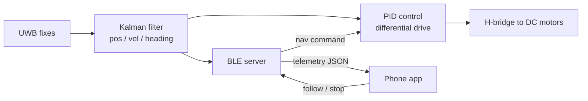

# Autonomous UWB-Tracking Smart Luggage

[](https://github.com/lxdinh/UWB_Luggage/actions/workflows/build.yml)
[](https://www.espressif.com/en/products/socs/esp32)
[](LICENSE)

> Core ESP32 / Arduino C++ firmware for a follow-me smart-luggage robot:
> **UWB positioning → Kalman sensor fusion → PID motor control**, with a BLE
> telemetry/command link to a companion phone app.

**IEEE Fall 2024 Quarterly Project** · Oct–Dec 2024

This repository is a focused code portfolio of the embedded-systems work:
sensor fusion, closed-loop motor control, and the BLE IoT protocol.

## Architecture



Three independent modules, glued together in [`UWB_Luggage.ino`](UWB_Luggage.ino):

| Module | Files | Responsibility |
| --- | --- | --- |
| Sensor fusion | `src/KalmanFilter_UWB.{h,cpp}` | Constant-velocity Kalman filter; fuses noisy UWB fixes into a smoothed 2-D position, velocity, and heading estimate. |
| Motor control | `src/MotorControl_PID.{h,cpp}` | Dual PID (range + heading) mixed to differential-drive PWM through an H-bridge. |
| Connectivity | `src/BLE_Interface.{h,cpp}` | BLE GATT server: streams telemetry (notify) and receives nav commands (write). |

## Repository layout

```text
UWB_Luggage/
├── UWB_Luggage.ino             # main sketch: setup/loop, glue + synthetic UWB source
├── src/
│   ├── KalmanFilter_UWB.{h,cpp}
│   ├── MotorControl_PID.{h,cpp}
│   └── BLE_Interface.{h,cpp}
├── test/
│   ├── arduino_shim/Arduino.h  # host stub so modules compile off-target
│   └── test_kalman.cpp         # native unit test for the filter
└── .github/workflows/build.yml # CI: ESP32 compile + host unit test
```

## Hardware

| Component | Detail |
| --- | --- |
| MCU | ESP32 (Arduino core) |
| Drive | 2× DC gear motors + encoders, via H-bridge |
| Motor supply | separate 9 V pack (common ground with the ESP32) |
| Positioning | UWB transceiver(s) |

**Default pin map** — these are placeholders set in `setup()`; change them to
match your wiring:

| Signal | GPIO |
| --- | --- |
| Left motor PWM | 25 |
| Left motor DIR | 26 |
| Right motor PWM | 27 |
| Right motor DIR | 14 |

> ⚠️ **Power note.** The drive motors run off a 9 V pack that sags under load,
> so PWM is intentionally capped (`60–220`, not `0–255`) to avoid browning out
> the ESP32 rail. Keep motor and logic grounds common, and do not back-feed the
> ESP32 from the motor supply.

## BLE protocol

- **Device name:** `UWB_SmartLuggage`
- **Service UUID:** `4fafc201-1fb5-459e-8fcc-c5c9c331914b`

| Characteristic | UUID | Properties | Payload |
| --- | --- | --- | --- |
| Telemetry | `beb5483e-36e1-4688-b7f5-ea07361b26a8` | Notify | JSON: `{"x":1.234,"y":0.567,"hdg":42.10,"spd":0.250}` |
| Nav command | `6d68efe5-04b6-47a0-8a2e-e1924769a2a4` | Write | UTF-8 text: `follow` or `stop` |

`hdg` is heading in degrees (`atan2(vy, vx)`); `spd` is in the same length
units as the UWB feed, per second.

## Build & flash

**Arduino IDE** — install the ESP32 boards package, select **ESP32 Dev
Module**, open `UWB_Luggage.ino`, and Upload.

**arduino-cli:**

```bash
arduino-cli core update-index --additional-urls https://espressif.github.io/arduino-esp32/package_esp32_index.json
arduino-cli core install   esp32:esp32 --additional-urls https://espressif.github.io/arduino-esp32/package_esp32_index.json
arduino-cli compile --fqbn esp32:esp32:esp32 .
arduino-cli upload  --fqbn esp32:esp32:esp32 -p <PORT> .   # e.g. -p COM5 or /dev/ttyUSB0
```

### Run without hardware

`loop()` feeds a synthetic UWB sample (a slow Lissajous path) into the filter,
so you can flash a bare ESP32, open the Serial Monitor at **115200 baud**, scan
for `UWB_SmartLuggage` over BLE, and watch live telemetry — with no UWB tag or
motors attached. Replace the synthetic block with your real tag driver when
integrating hardware (the single seam is `kfUpdateFromUWB(x, y)`).

## Tests

The filter math is pure C++ and is unit-tested on the host (no ESP32 needed):

```bash
g++ -std=c++17 -I test/arduino_shim -I src test/test_kalman.cpp src/KalmanFilter_UWB.cpp -o kf_test
./kf_test
```

CI (GitHub Actions) runs this test **and** a full ESP32 compile on every push —
see the badge at the top.

## Scope & limitations

This is a portfolio extract, not turn-key firmware. Honest caveats:

- The filter is a **linear, constant-velocity Kalman filter**. The module is
  structured so it can be extended toward a full EKF with a nonlinear
  motion/measurement model.
- PID gains and PWM scaling are tuned for a specific chassis and demo; re-tune
  for your hardware.
- The UWB radio driver itself is out of scope here — the sketch exposes a single
  `kfUpdateFromUWB(x, y)` seam where real tag readings plug in.
- Pin assignments are placeholders.

## Roadmap

- [ ] Real UWB tag driver (DW1000/DW3000) feeding `kfUpdateFromUWB()`
- [ ] Encoder odometry as a second Kalman measurement (true multi-sensor fusion)
- [ ] Obstacle-stop / bumper input
- [ ] Companion app reference client

## License

MIT — see [LICENSE](LICENSE).
